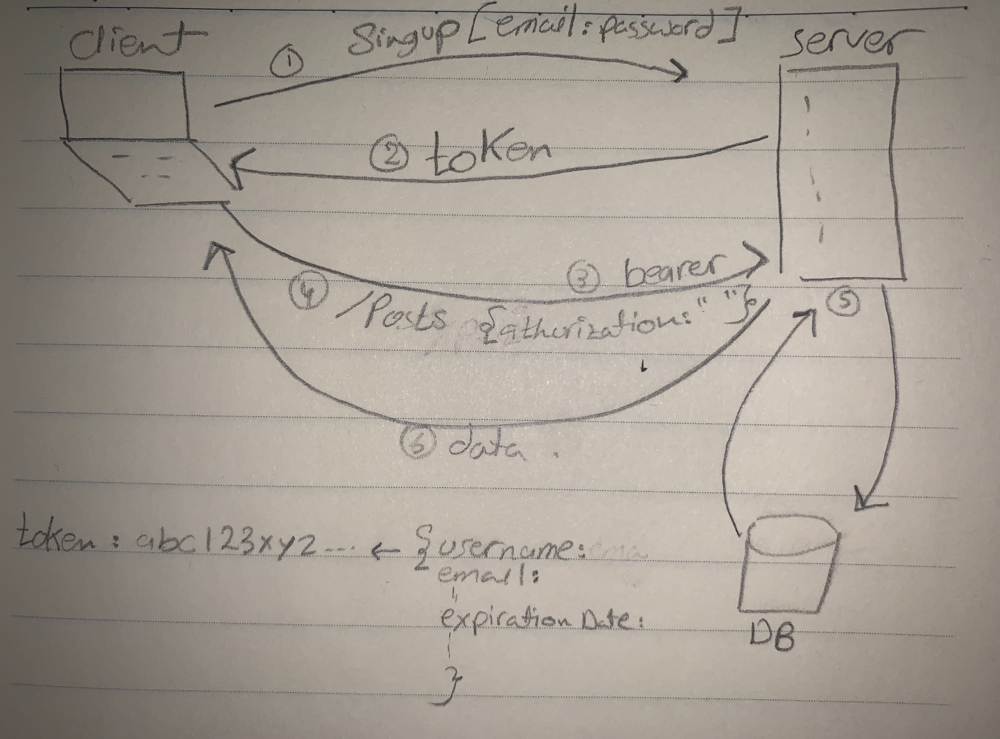

# auth-server

# LAB - Class 11

# Author: 
  -  Amal Almomani
  
# lab name
  - Authentication

## pull request link

  - [pull request](https://github.com/amal-401-advanced-javascript/api-serve/pull/11)

## Links and Resources
  - [GET](http http://localhost:3000/users)
  - [Heroku]()
  - 

## Modules
  - Postman
  - Swagger

## Setup
  - .env requirements
    - `PORT - 3000`

## How to use your library 
  - npm i express  
  - npm i base-64
  - npm i bcryptjs
  - npm i jsonwebtoken
  - npm i mongoose
  - npm i morgan

## How to initialize/run your application
  - nodemon
  - node index.js
  
## Tests
  - npm i -D jest => jest
  - npm i supertest => lint

## UML
 - 
 - 
 - 

 
